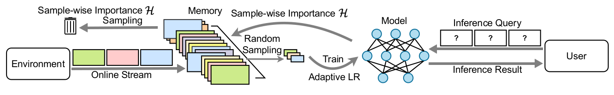

# Official Implementation of CLIB (Continual Learning for i-Blurry)

**Online Continual Learning on Class Incremental Blurry Task Configuration with Anytime Inference**<br>
Hyunseo Koh<sup>\*</sup>, Dahyun Kim<sup>\*</sup>, Jung-Woo Ha, Jonghyun Choi<br>
ICLR 2022 [[Paper](https://openreview.net/pdf?id=nrGGfMbY_qK)]<br>
(\* indicates equal contribution)

## Overview



### Abstract
Despite rapid advances in continual learning, a large body of research is devoted to improving performance in the existing setups.
While a handful of work do propose new continual learning setups, they still lack practicality in certain aspects.
For better practicality, we first propose a novel continual learning setup that is online, task-free, class-incremental, of blurry task boundaries and subject to inference queries at any moment.
We additionally propose a new metric to better measure the performance of the continual learning methods subject to inference queries at any moment.
To address the challenging setup and evaluation protocol, we propose an effective method that employs a new memory management scheme and novel learning techniques.
Our empirical validation demonstrates that the proposed method outperforms prior arts by large margins.
### Results
Results of CL methods on various datasets, for online continual learning on i-Blurry-50-10 split, measured by  metric.
For more details, please refer to our [paper](https://arxiv.org/pdf/2110.10031.pdf).

| Methods     | CIFAR10        | CIFAR100       | TinyImageNet   | ImageNet  |
|-------------|----------------|----------------|----------------|-----------|
| EWC++       | 57.34±2.10     | 35.35±1.96     | 22.26±1.15     | 24.81     |
| BiC         | 58.38±0.54     | 33.51±3.04     | 22.80±0.94     | 27.41     |
| ER-MIR      | 57.28±2.43     | 35.35±1.41     | 22.10±1.14     | 20.48     |
| GDumb       | 53.20±1.93     | 32.84±0.45     | 18.17±0.19     | 14.41     |
| RM          | 23.00±1.43     | 8.63±0.19      | 5.74±0.30      | 6.22      |
| Baseline-ER | 57.46±2.25     | 35.61±2.08     | 22.45±1.15     | 25.16     |
| **CLIB**    | **70.26±1.28** | **46.67±0.79** | **23.87±0.68** | **28.16** |

## Getting Started
To set up the environment for running the code, you can either use the docker container, or manually install the requirements in a virtual environment.
### Using Docker Container (Recommended)
We provide the Docker image `khs8157/iblurry` on Docker Hub for reproducing the results.
To download the docker image, run the following command:
<pre>
docker pull khs8157/iblurry:latest
</pre>
After pulling the image, you may run the container via following command:
<pre>
docker run --gpus all -it --shm-size=64gb -v <i>/PATH/TO/CODE</i>:<i>/PATH/TO/CODE</i> --name=<i>CONTAINER_NAME</i> khs8157/iblurry:latest bash
</pre>
Replace the arguments written in <i>italic</i> with your own arguments.

### Requirements
- Python3
- Pytorch (>=1.9)
- torchvision (>=0.10)
- numpy
- pillow~=6.2.1
- torch_optimizer
- randaugment
- easydict
- pandas~=1.1.3

If not using Docker container, install the requirements using the following command
<pre>
pip install -r requirements.txt
</pre>

## Running Experiments

### Downloading the Datasets
CIFAR10, CIFAR100, and TinyImageNet can be downloaded by running the corresponding scripts in the `dataset/` directory.
ImageNet dataset can be downloaded from [Kaggle](https://www.kaggle.com/c/imagenet-object-localization-challenge).

### Experiments Using Shell Script
Experiments for the implemented methods can be run by executing the shell scripts provided in `scripts/` directory.
For example, you may run CL experiments using CLIB method by
<pre>
bash scripts/clib.sh
</pre>
You may change various arguments for different experiments.
- `NOTE`: Short description of the experiment. Experiment result and log will be saved at `results/DATASET/NOTE`.
  - WARNING: logs/results with the same dataset and note will be overwritten!
- `MODE`: CL method to be applied. Methods implemented in this version are: [clib, er, ewc++, bic, mir, gdumb, rm]
- `DATASET`: Dataset to use in experiment. Supported datasets are: [cifar10, cifar100, tinyimagenet, imagenet]
- `N_TASKS`: Number of tasks. Note that corresponding json file should exist in `collections/` directory.
- `N`: Percentage of disjoint classes in i-blurry split. N=100 for full disjoint, N=0 for full blurry. Note that corresponding json file should exist in `collections/` directory.
- `M`: Blurry ratio of blurry classes in i-blurry split. Note that corresponding json file should exist in `collections/` directory.
- `GPU_TRANSFORM`: Perform AutoAug on GPU, for faster running.
- `USE_AMP`: Use automatic mixed precision (amp), for faster running and reducing memory cost.
- `MEM_SIZE`: Maximum number of samples in the episodic memory.
- `ONLINE_ITER`: Number of model updates per sample.
- `EVAL_PERIOD`: Period of evaluation queries, for calculating .

## Citation
If you used our code or i-blurry setup, please cite our paper.
<pre>
@inproceedings{koh2022online,
  title={Online Continual Learning on Class Incremental Blurry Task Configuration with Anytime Inference},
  author={Koh, Hyunseo and Kim, Dahyun and Ha, Jung-Woo and Choi, Jonghyun},
  booktitle={ICLR},
  year={2022}
}
</pre>

## License
```
Copyright (C) 2022-present NAVER Corp.

This program is free software: you can redistribute it and/or modify
it under the terms of the GNU General Public License as published by
the Free Software Foundation, either version 3 of the License, or
(at your option) any later version.

This program is distributed in the hope that it will be useful,
but WITHOUT ANY WARRANTY; without even the implied warranty of
MERCHANTABILITY or FITNESS FOR A PARTICULAR PURPOSE.  See the
GNU General Public License for more details.

You should have received a copy of the GNU General Public License
along with this program.  If not, see <https://www.gnu.org/licenses/>.
```
